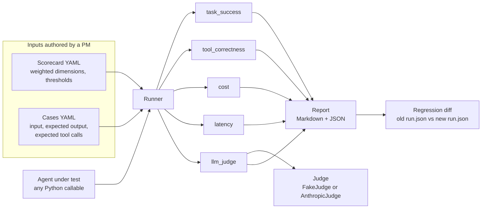

# agent-evals

[](https://github.com/25andresbernal/agent-evals/actions/workflows/ci.yml)

A lightweight framework for evaluating LLM agents against a PM-authored
scorecard: task success, tool-call correctness, cost, latency, and a
rubric-based quality score run by an LLM judge.

## Why this exists

Most agent demos are judged by a few minutes of poking at them. That tells
you how the agent does on the inputs you happened to try, not whether it is
good. Shipping an agent without a scorecard is shipping without a
definition of "good" to check it against, before or after launch.

`agent-evals` gives a PM a small, ownable set of files, a scorecard and a
list of cases, that define what "good" means for a specific agent, plus a
CLI that runs an agent against them and produces a report a non-engineer
can read. It ships with a complete, working example so you can see the
whole pipeline before you plug in your own agent.

## Demo

The repository includes an example: a small rule-based customer support
agent, evaluated against ten cases. Running it looks like this (real
output, not illustrative):

```
$ agent-evals run examples/support_agent/suite.yaml \
    --out examples/support_agent/report.md \
    --json examples/support_agent/run.json
wrote report to examples/support_agent/report.md
wrote run data to examples/support_agent/run.json
10/10 cases passed
```

And a snippet of the generated report, committed at
[`examples/support_agent/report.md`](examples/support_agent/report.md):

```markdown
# Support Agent Eval Suite

Generated 2026-09-24 04:41 UTC. 10 cases, 10 passed, 0 failed (100% pass rate). Average weighted score 0.97 against a pass threshold of 0.75.

## Summary by dimension

| Dimension | Weight | Avg score | Threshold | Cases below threshold |
|---|---|---|---|---|
| task_success | 0.35 | 1.00 | 0.80 | 0 |
| tool_correctness | 0.3 | 1.00 | 0.80 | 0 |
| quality | 0.2 | 0.86 | 0.60 | 0 |
| cost | 0.1 | 1.00 | 0.90 | 0 |
| latency | 0.05 | 1.00 | 0.90 | 0 |
```

The full report also includes a per-case table and, when a case fails, a
details section with the input, the output, and which dimension fell
short and why.

## Architecture



## Quick start

Takes under five minutes, no API key required.

```bash
git clone https://github.com/25andresbernal/agent-evals.git
cd agent-evals

export PATH="$HOME/.local/bin:$PATH"   # if uv is not already on PATH
uv venv --python 3.12
uv pip install -e ".[dev]"

# Run the committed example end to end
uv run agent-evals run examples/support_agent/suite.yaml \
  --out examples/support_agent/report.md \
  --json examples/support_agent/run.json

# Run the test suite
uv run pytest
```

Scaffold your own suite:

```bash
uv run agent-evals init my_agent_eval --name "My Agent Eval"
```

This writes `suite.yaml`, `scorecard.yaml`, `cases.yaml`, and a stub
`agent.py` into `my_agent_eval/`. Edit `agent.py` to call your real agent,
edit `cases.yaml` with real inputs and expectations, adjust
`scorecard.yaml` to match what your team actually cares about, then run it
the same way as the example above.

## Configuration

No configuration is required to run the example or the test suite. The
only optional setting is an Anthropic API key, used solely to switch the
quality dimension from the offline `FakeJudge` to a real Claude model:

```bash
cp .env.example .env
# edit .env and set ANTHROPIC_API_KEY
```

Then either set `judge: anthropic` in a suite's YAML file, or pass
`--judge anthropic` on the command line. The judge model defaults to
`claude-sonnet-5` and can be overridden with `--judge-model` or the
suite's `judge_model` field.

The cost scorer uses a small, editable pricing table in
`src/agent_evals/pricing.py`. Update it when prices change or your model
is not listed, or pass a `cost_usd` directly on your agent's response to
bypass estimation entirely.

## How it works

- **`Scorecard`** (YAML): named dimensions, each with a scorer, a weight,
  and a pass threshold. The scorecard's own `pass_threshold` applies to the
  weighted average across dimensions; each dimension's own threshold is
  checked independently, so one strong dimension cannot mask a
  specifically weak one.
- **`EvalCase`** (YAML): one input, what the output should contain (or
  match exactly, or satisfy via a custom function), which tool calls are
  expected and with what arguments, and free-form tags.
- **`Runner`**: takes any Python callable with the signature
  `(message: str) -> AgentResponse` as the agent under test. It calls the
  agent for each case, times it, resolves cost from token counts or an
  explicit override, and runs every dimension's scorer.
- **Scorers**: `task_success` (exact, contains, or a custom function),
  `tool_correctness` (name and argument matching, with a strict mode),
  `cost` and `latency` (budget-based scoring with linear decay past
  budget), and `llm_judge` (a rubric scored by a pluggable `Judge`).
- **`Report`**: renders the Markdown report shown above, a JSON run file
  for machine consumption, and a Markdown regression diff between two JSON
  runs via `agent-evals compare`.

## Design decisions

A few choices worth knowing about, and the tradeoff behind each one.

- **The agent interface is a plain callable, not a framework adapter.**
  Any agent, rule-based, a thin API wrapper, or a full framework, can be
  evaluated by writing one function with the right signature. The
  tradeoff: `agent-evals` has no native integration with any specific
  agent framework. That is deliberate: a PM should be able to point this
  at whatever the engineering team is actually using without waiting on
  an adapter.
- **`FakeJudge` is offline and deterministic by default.** Tests and the
  quick start never require a network call or a paid API key. The
  tradeoff: `FakeJudge`'s heuristic is not a real quality signal, only a
  stand-in that exercises the pipeline. Treat any run scored with it as a
  smoke test, not a quality verdict; switch to `AnthropicJudge` before a
  real ship decision.
- **Per-dimension thresholds are checked separately from the weighted
  average.** A weighted average alone lets a strength hide a weakness (a
  great responder that is unsafe on tool calls can still average well).
  The tradeoff: a scorecard author has two numbers to set per dimension,
  a weight and a threshold, instead of one, which is more setup but a more
  honest pass/fail line.
- **Tool-call matching checks a subset of arguments, not an exact match, by
  default.** Requiring every argument key to match exactly would break on
  any field the agent adds that a case did not anticipate, like a trace ID
  or a timestamp. The tradeoff: an agent could pass an argument check while
  quietly getting an unlisted argument wrong. Strict mode
  (`config.strict: true`) is available when a case needs to rule out
  anything extra.
- **The CLI resolves an agent from a file path (`agent.py:function_name`)
  by default, not a Python import path.** This means a suite runs from any
  directory without the agent needing to be an installed package or the
  caller needing to manage `PYTHONPATH`. The tradeoff: dynamically loading
  a file by path is slightly less conventional than a normal import; a
  dotted `module:function` path still works for agents that are already
  packaged.

## Roadmap

- A hosted or CI-friendly summary output (for example, a single-line pass
  and score summary suitable for a pull request comment).
- Additional built-in scorers: JSON-schema validation of tool arguments,
  and a semantic-similarity task_success mode.
- A second built-in judge implementation for a non-Anthropic provider, to
  make the judge interface's provider-agnostic design concrete with a
  second example, not just the protocol.
- Parallel case execution in `Runner`, for suites large enough that
  sequential runs are slow.

## Contributing

Issues and pull requests are welcome. Before opening a pull request:

```bash
uv run ruff check .
uv run ruff format .
uv run pytest
```

Keep new scorers and judges behind the same interfaces described in "How
it works" so a custom one only ever needs a `module:function` path or a
`judge(input, output, rubric)` method, nothing more.

## License

MIT. See [LICENSE](LICENSE).
